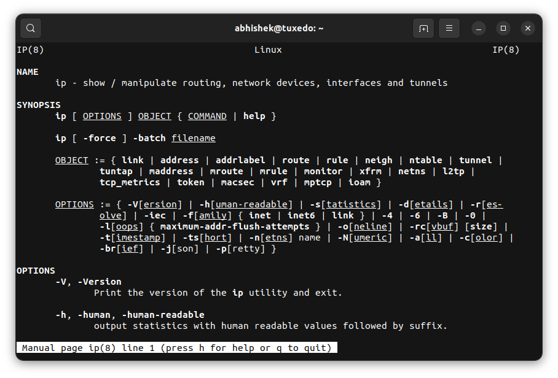
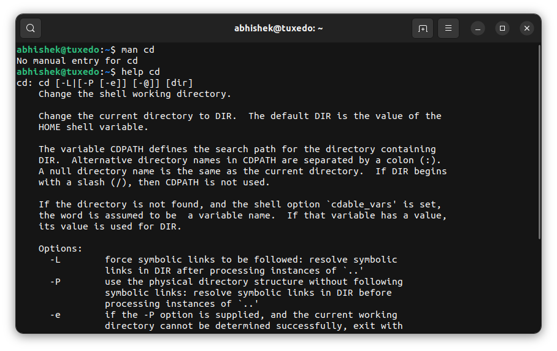
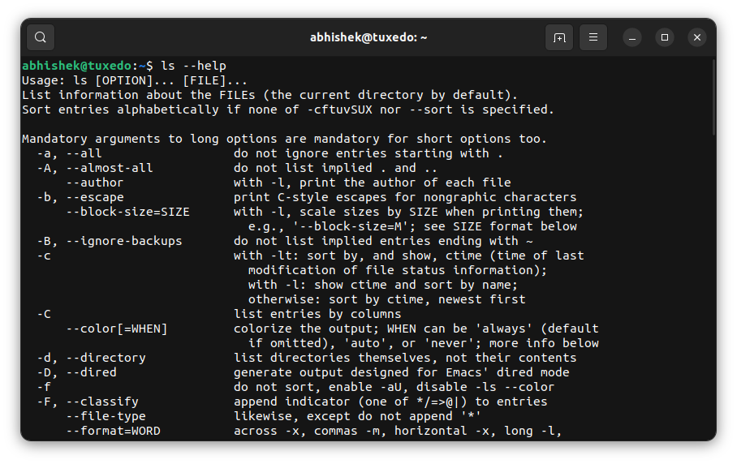

# 终端基础：在 Linux 终端中获取帮助

>source: [https://itsfoss.com/linux-command-help/](https://itsfoss.com/linux-command-help/)
>
>作者：[Abhishek Prakash](https://itsfoss.com/author/abhishek/)
>
>译者：[DeepSeek](https://chat.deepseek.com)
>
>校对：[Churnie HXCN](https://github.com/excniesNIED)

学习如何在终端基础系列的最后一章中获取有关使用 Linux 命令的帮助。

如今，你可以通过搜索互联网来获取任何命令的使用方法和示例。

但在互联网不存在或没有广泛普及的时候，情况并非如此。

因此，Linux（及其之前的操作系统）中的命令都带有帮助或手册页（man pages）。这作为参考，用户可以随时访问以查看命令的可用选项及其工作原理。

在信息丰富的今天，man pages 仍然具有相关性。

首先，它们是原始的命令文档，因此是命令使用的最可信来源。

其次，如果你正在参加某个 Linux 考试，你可能不被允许在互联网上搜索，但 man pages 总是可供你使用。

现在你了解了在终端中直接获取帮助的重要性，让我们进一步了解它们。

## 在终端中获取 Linux 命令的帮助

有两个主要的命令可以获取 Linux 命令的使用帮助：

- help：用于 shell 内置命令
- man：用于其他 Linux 命令

### 等等！什么是 shell 内置命令？

你可能会觉得像 ls、rm、mv 这样的命令是 bash shell 的一部分。但事实并非如此。Shell 只有少数命令是作为 shell 本身的一部分内置的。这就是为什么它们被称为内置命令。内置命令的一些例子是 echo、cd 和 alias。

其他流行的 Linux 命令，如 ls、mv、rm、cat、less 等，是名为 [GNU coreutils](https://www.gnu.org/software/coreutils/?) 的软件包的一部分。它们几乎在所有 Linux 发行版上都预装了。

你不会找到 shell 内置命令的 man pages。

```Bash
abhishek@tuxedo:~$ man cd
No manual entry for cd
```

man pages 适用于这些“外部”Linux 命令。内置命令有帮助部分。

!!! question "💡"

    想查看所有内置 shell 命令吗？只需输入 help 即可列出它们。

### 使用 man 查看命令文档

使用 man 命令很简单。只需像这样给出命令的名称：

```Bash
man command_name
```

它将打开该命令的手册页。你会找到命令的语法、选项以及对选项的简要解释。



页面通常使用 [less 命令](https://itsfoss.com/view-file-contents/) 打开，因此你可以使用所有 [less 命令的键盘快捷键](https://linuxhandbook.com/less-command/?) 来移动和搜索文本。

不记得了吗？这将帮助你回忆

| **键**      | **操作**                            |
| ----------- | ----------------------------------- |
| 向上箭头    | 向上移动一行                        |
| 向下箭头    | 向下移动一行                        |
| 空格或 PgDn | 向下移动一页                        |
| b 或 PgUp   | 向上移动一页                        |
| g           | 移动到文件开头                      |
| G           | 移动到文件末尾                      |
| ng          | 移动到第 n 行                       |
| /pattern    | 搜索模式并使用 n 移动到下一个匹配项 |
| q           | 退出                                |

man pages 的内容远不止这些。我无法在这里全部涵盖，但我们有一份详细的指南。欢迎参考。

[RTFM！如何阅读（和理解）Linux 中神奇的手册页](https://linux.net.cn/article-13478-1.html)

### 使用 help 命令获取 shell 内置命令的帮助

如前所述，内置 shell 命令没有 man pages。相反，你使用 help 命令像这样：

```Bash
help command_name
```

它会显示命令选项的摘要。整个内容会显示在屏幕上，与 man 命令不同。



### 所有命令的帮助选项

你是否觉得 man page 信息太多，只想查看命令的选项？帮助选项可以帮到你。

几乎所有 Linux 命令都提供了一个 `--help` 选项，可以总结可用的选项。



然而，这不是硬性规定。某些命令的帮助部分相当简陋。试试 ip 命令。

## 在 Linux 终端中获取帮助的更多方法

还有 `info` 命令，它的工作方式类似于` man` 命令。

如果你觉得 man pages 难以理解，有一些第三方工具可以简化 man pages 的内容，使其对初学者更友好。TLDR 就是这样一个你可以使用的包。

[TLDR 页：Linux 手册页的简化替代品](https://linux.net.cn/article-10355-1.html)

换句话说，帮助只需按几下键即可获得。

并不是只有新的 Linux 用户需要帮助。经验丰富的 Linux 用户特别依赖 manpages。所以不要回避在终端中使用帮助。

我还建议 [使用 history 命令](https://linux.net.cn/article-9780-1.html)。这样，你可以搜索之前输入的命令。

[5 个有趣的 Linux 命令行技巧](https://linux.net.cn/article-5485-1.html)

## 这是结束... 或开始

至此，我结束了 Linux 终端基础系列。

在这个系列的十章中，你熟悉了终端，学会了在终端中移动，以及创建、移动和删除文件和文件夹。你还学会了阅读和编辑文件。

这为你打下了 Linux 命令的基本但坚实的基础。这可能是这个系列的结束，但它帮助你开始了你的 Linux 命令行之旅。

你将在 It's FOSS 上找到更多关于“在 Linux 命令行中做事”的深入指南。它可能不是以系列的形式（或者可能是），但你会有很多学习的机会。

💬 *我希望你喜欢这个初学者系列。我欢迎你对这个系列的可用性提供反馈，并提出改进建议。如果你有任何相关的新系列建议，请不要犹豫。评论部分正等着你。*