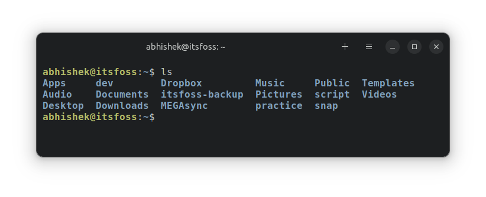
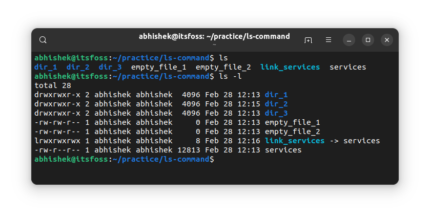
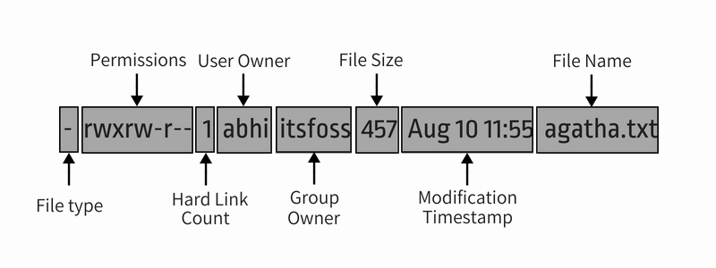
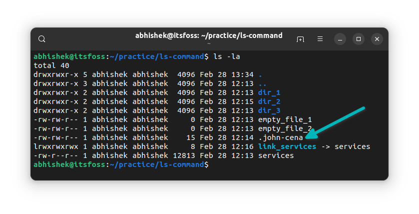
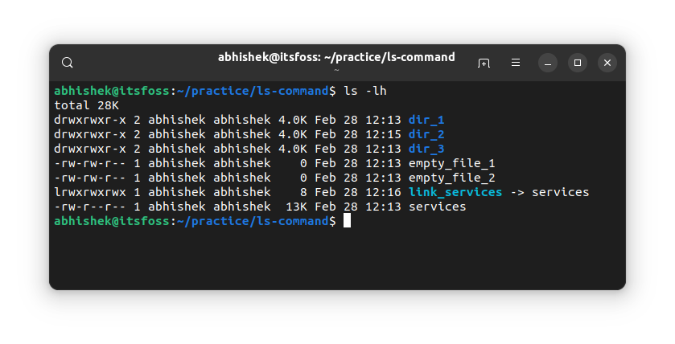
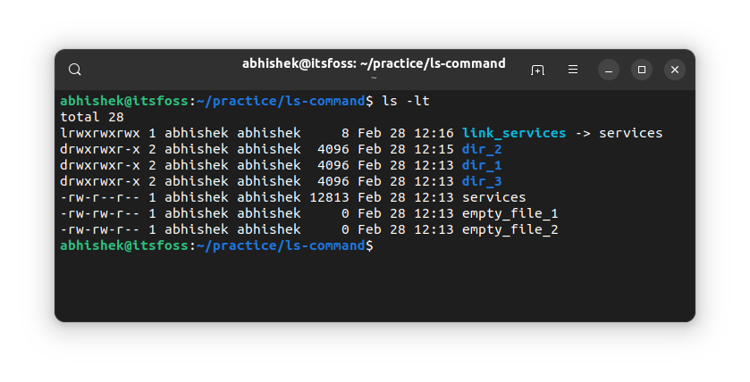
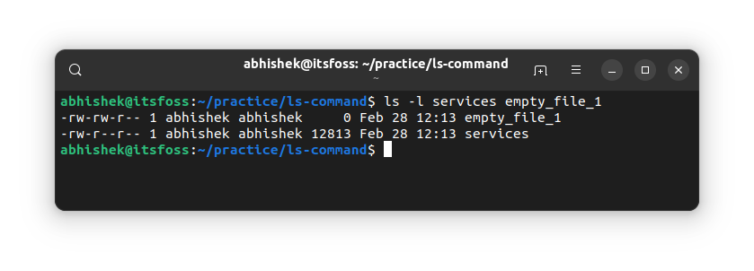

# 终端基础：列出目录内容

>source：[https://itsfoss.com/list-directory-content/](https://itsfoss.com/list-directory-content/)
>
>作者：[Abhishek Prakash](https://itsfoss.com/author/abhishek/)
>
>译者：[DeepSeek](https://chat.deepseek.com)
>
>校对：[Churnie HXCN](https://github.com/excniesNIED)

在本章终端基础知识系列中，你将学习如何显示目录内容、对目录内容进行排序以及检查文件统计信息。

Linux 中的 `ls` 命令用于列出目录内容。 你可以把 `ls` 想象成 `list` 的简写。



除了列出目录内容外，还有更多信息。 你可以查看文件大小、创建时间、是文件还是目录以及文件权限。 你甚至可以根据这些条件对输出进行排序。

我就不多说了。 在这个阶段，你应该只知道足够多的基本知识。

## 准备测试设置

本终端基础系列教程采用动手实践的方式，通过实践来学习知识。 最好在系统上创建一个工作场景，这样你就可以尝试一些事情并看到类似的结果，如本教程所示。

打开终端并切换到主目录，在 `practice` 目录下创建一个 `ls-command` 目录，然后进入这个新建的目录。

```Bash
cd ~
mkdir -p practice/ls-command
cd practice/ls-command
```

**如果您不认识这里的某些命令也没关系。 只需按提示输入即可。**

创建几个空文件：

```Bash
touch empty_file_{1,2}
```

复制一个巨大的文本文件

```Bash
cp /etc/services .
```

创建几个目录：

```Bash
mkdir dir_{1..3}
```

创建隐藏文件：

```Bash
echo "Now You See Me" > .john-cena
```

最后，我们用一个软链接（如文件的快捷方式）来结束设置：

```Bash
ln -s services link_services
```

让我们看看 `ls-command` 目录现在的样子：

```Bash
abhishek@itsfoss:~/practice/ls-command$ ls
dir_1  dir_2  dir_3  empty_file_1  empty_file_2  link_services  services
```

## 长列表： 详细信息

虽然 `ls` 命令可以显示内容，但并不能提供任何有关内容的详细信息。

这时可以使用长列表选项 `-l`。

```Bash
ls -l
```

它将按字母顺序显示目录的单行内容和附加信息：



!!! note "📋"

    大多数 Linux 发行版都预设了以不同颜色显示文件、目录和链接的功能。 可执行文件也用不同颜色显示。

您将在长列表中看到以下信息：

- **文件类型**： - 文件类型：代表文件，d 代表目录，l 代表软链接。
- **硬链接数量**： 通常为 1，除非确实存在硬链接（不必过于担心）。
- **所有者名称**：拥有该文件的用户。
- **组名称**：可以访问该文件的组。
- **文件大小**： 文件的大小（以字节为单位）。 对于目录，无论目录大小如何，都是 4K（或 4096）。
- **日期和时间**： 通常是文件的最后修改时间和日期。
- **文件名**：文件、目录或链接的名称。


*文件详细信息一目了然*

了解文件权限和所有权是个好主意。 我强烈建议阅读本教程。↓

[通过示例解释 Linux 文件权限和所有权](https://cn.linux-console.net/?p=20183)

## 显示隐藏文件

记得你创建了一个名为 `.john-cena` 的“隐藏文件”吗？但你没有在 `ls` 命令的输出中看到它。

在Linux中，如果文件名以点（.）开头，该文件或目录就会从正常视图中隐藏。

要查看这些“隐藏文件”，你需要使用选项 `-a`：

```Bash
ls -a
```

实际上，大多数 Linux 命令中你可以组合多个选项。让我们将其与长列表选项结合起来：

```Bash
ls -la
```

现在，它会显示隐藏的 `.john-cena` 文件：


*在ls命令输出中包含隐藏文件*

你注意到现在也显示了特殊目录 `.`（当前目录）和 `..`（父目录）吗？

你可以使用选项 `-A` 而不是 `-a` 来让它们消失，同时仍然显示其他隐藏文件。去试试吧。

## 显示文件大小

长列表选项 `-l` 显示文件大小。然而，这并不容易理解。例如，在上面的例子中， services 文件的大小为 12813 字节。

作为普通计算机用户，看到文件大小以 KB、MB 和 GB 为单位更有意义。

ls 命令有一个人类可读的选项 `-h`。将其与长列表选项结合起来，你就可以看到易于识别的文件大小格式。


*使用 ls 命令查看文件大小*

!!! question "💡"

    ls 命令不显示目录的大小。 要查看目录大小，可以使用 `du` 命令。

## 优先显示最新文件

你已经看到长列表显示了文件/目录的修改时间。

你可以使用 `-t` 选项根据这个时间戳对ls命令的输出进行排序：

```Bash
ls -lt
```

如你所见，链接是最新的一项。



!!! note "🖥️"

    要先显示较旧的文件，可以将上述选项 -t 与反向选项 -r 结合起来。你会看到什么？

```Bash
ls -ltr
```

通过这个命令，输出将按照修改时间从旧到新排序。

## 显示单个文件的详细信息

到目前为止，你已经在整个当前目录上使用了 `ls` 命令。你也可以在单个文件或一组文件和目录上使用它。有什么用呢？嗯，你可以使用长列表选项来获取所选文件的详细信息。

```Bash
ls path_to_file1 path_to_file2
```

这里有一个例子：


*使用ls命令获取所选文件的统计信息*

!!! question "🏋️"

    如果你使用带有目录路径的 `ls` 命令，它会显示其内容。如果你想查看目录的统计信息，请使用选项 `-d`。

## 📝 测试你的知识

大多数 Linux 命令都有许多选项。即使对于像 ls 这样最常用的命令，任何人也不可能知道所有的选项。

现在，你对列出目录内容和检查文件统计信息有了一个不错的了解。是时候对你的知识进行一些测试了。

尝试以下操作：

- 创建一个名为 `ls_exercise` 的新目录并进入该目录
- 使用以下命令复制一个文件：`cp /etc/passwd .`
- 检查目录的内容。文件名是什么？
- 这个文件的大小是多少？
- 使用以下命令复制更多文件：`cp /etc/aliases /etc/os-release /etc/legal .`
- 按修改时间的反向顺序对文件进行排序。
- 如果你运行以下命令：`ls -lS`，你会观察到什么？

在终端入门系列的下一章中，你将学习如何在 Linux 命令行中创建文件。

如果有任何问题或建议，请告诉我。