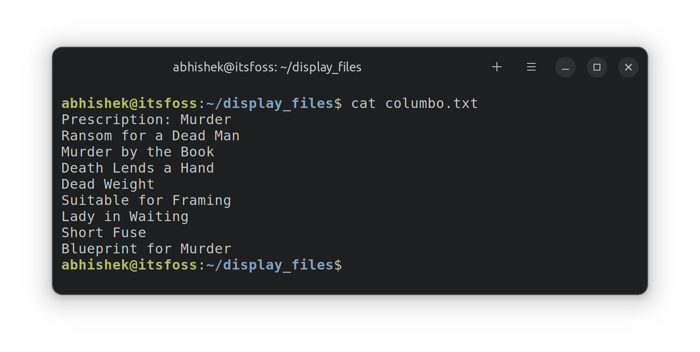
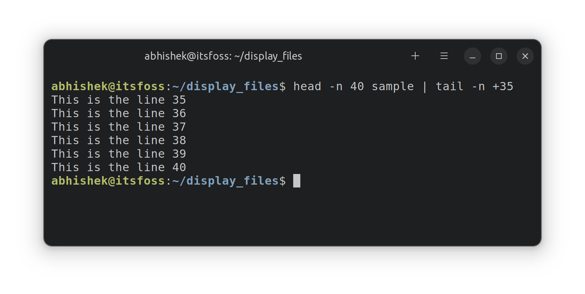
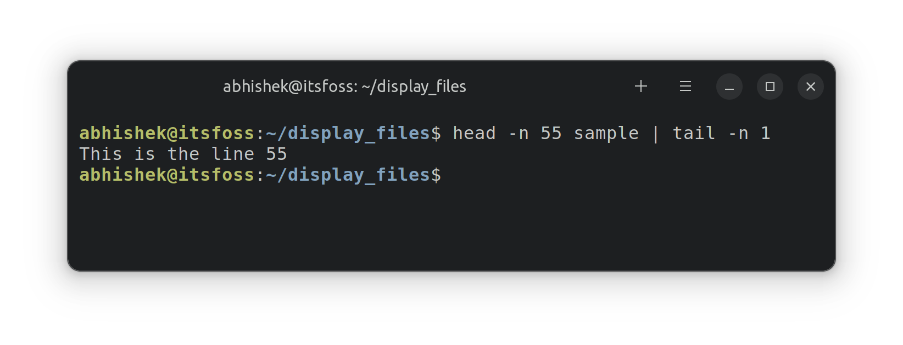

# 终端基础：在 Linux 中查看文件内容

>source：[https://itsfoss.com/view-file-contents/](https://itsfoss.com/view-file-contents/)
>
>作者：[Abhishek Prakash](https://itsfoss.com/author/abhishek/)
>
>译者：[DeepSeek](https://chat.deepseek.com)
>
>校对：[Churnie HXCN](https://github.com/excniesNIED)

在本章的终端基础系列中，你将学习如何在 Linux 命令行中查看文件内容。

在前一章的终端基础系列中，你学会了创建新文件。

在本章中，你将学习如何读取文件。我将讨论最常见的Linux命令来显示文本文件的内容。

在你开始之前，让我们用示例文件创建我们的“操场”。首先创建一个目录并切换到它。

```Bash
mkdir display_files && cd display_files
```

复制一个大文本文件到这里。

```Bash
cp /etc/services .
```

然后，创建一个名为 `columbo.txt` 的新文件，包含以下文本（使用上一章讨论的 `cat` 命令和 `>>`）：

```
Prescription: Murder
Ransom for a Dead Man
Murder by the Book
Death Lends a Hand
Dead Weight
Suitable for Framing
Lady in Waiting
Short Fuse
Blueprint for Murder
```

你不必自己全部输入。你可以在终端中使用 Ctrl + Shift + V 进行复制粘贴。大多数终端都支持这个快捷键。

准备工作完成后，让我们看看在 Linux 终端中查看文件的各种方法。

## 使用 cat 命令显示文件内容

`cat` 命令是在 Linux 中查看文件最流行的方法。

使用它非常简单。只需给它文件名，它就会在屏幕上显示文件内容。没有比这更简单的了。

```Bash
cat filename
```

你能尝试显示 `columbo.txt` 文件的内容吗？

```Bash
cat columbo.txt
```

这是它显示的输出：

*使用 cat 命令在 Linux 中查看文件*

!!! note "🏋️"

    可选挑战：使用 `cat` 或 `echo` 命令和 `>>` 重定向，在 `columbo.txt` 文件中添加一行包含“Etude in Black”文本的新行。如果需要帮助，请参考上一章。

## 使用 less 命令读取大文本文件

`cat` 命令非常简单。事实上，它太简单了。简单在复杂场景中并不适用。

尝试使用 `cat` 命令查看 `services` 文件的内容。

```Bash
cat services
```

这个 `services` 文件包含数百行内容。当你使用 `cat` 时，它会用整个文本充满整个屏幕。

这并不理想。你能读取文件的第一行吗？是的，你可以，但你必须一直向上滚动。如果文件有数千行，你甚至无法滚动回前几行。

这就是 `less` 命令发挥作用的地方。它允许你以分页方式读取文件内容。你退出查看模式后，终端屏幕就像以前一样干净。

使用 `less` 命令读取 `services` 文件：

```Bash
less services
```

现在你处于不同的查看模式。你可以使用箭头键逐行移动。你也可以使用 Page Up 和 Page Down 键逐页上下移动。

你甚至可以使用 `/search_term` 搜索特定文本。

当你完成读取文件后，**按 Q 键退出 less 视图**并返回到正常终端视图。


*使用 less 命令查看大文本文件*

这个表格将帮助你使用 less：

| **键**      | **动作**                          |
| ----------- | --------------------------------- |
| 向上箭头    | 向上移动一行                      |
| 向下箭头    | 向下移动一行                      |
| 空格或 PgDn | 向下移动一页                      |
| b 或 PgUp   | 向上移动一页                      |
| g           | 移动到文件开头                    |
| G           | 移动到文件末尾                    |
| ng          | 移动到第n行                       |
| /pattern    | 搜索模式并使用n移动到下一个匹配项 |
| q           | 退出less                          |

从实时查看文件到书签文本，less 可以做更多的事情。阅读这篇文章了解更多：

[9 个 Linux 中 Less 命令的实用示例](https://cn.linux-console.net/?p=20185)

!!! question "💡"

    你可以使用less命令在终端中读取PDF文件。

## 使用 head 和 tail 显示部分文本文件

如果你只想在类似 `cat` 的显示中查看文本文件的某些部分，可以使用 `head` 和 `tail` 命令。

默认情况下，`head` 命令显示文件的前 10 行。

```Bash
head filename
```

但你也可以修改它以显示前 n 行。

```Bash
head -n filename
```

`tail` 命令默认显示文件的最后 10 行。

```Bash
tail filename
```

但你也可以修改它以显示底部 n 行。

```Bash
tail -n filename
```

### 练习示例

让我们看一些示例。使用这个脚本生成一个易于跟随的文件：

```Bash
# 创建或清空文件内容
echo -n > sample

# 向文件添加内容
for i in {1..70}
do
  echo "This is the line $i" >> sample
done
```

创建一个名为 `script.sh` 的新文件，并将上述脚本内容复制粘贴到其中。然后像这样运行脚本以生成你的示例文件：

```Bash
bash script.sh
```

现在，你有了一个名为 `sample` 的文件，其中包含70行类似“This is the line number N”的内容。

!!! note "🏋️"

    显示这个`sample`文件的前 10 行和后 10 行。

让我们更进一步。你可以将它们结合起来显示文件的特定行。例如，要显示第 35 到 40 行，可以这样使用：

```Bash
head -n 40 filename | tail -n +35
```

这里：

- `head -n 40 filename` 将显示文件的前 40 行。
- `tail -n +35` 将显示从第 35 行到 `head` 命令输出的末尾的行。注意 + 号改变了 `tail` 命令的正常行为。



你也可以将它们结合起来只显示特定的一行。假设你想显示第 55 行；可以这样结合 `head` 和 `tail`：

```Bash
head -n 55 filename | tail -n 1
```

这里：

- `head -n 55 filename` 将显示文件的前 55 行。
- `tail -n 1` 将显示 `head` 命令输出的最后一行，即文件的第 55 行。



## 📝 测试你的知识

是时候锻炼你的大脑并练习你在本章学到的内容了。

- 使用相同的 `sample` 文件，显示第 63 到 68 行。
- 现在显示第 67 到 70 行。
- 如何只显示第一行？
- `/etc/passwd`文件中有什么内容？显示其内容。

这就是本章的内容。接下来，你将学习如何在命令行中删除文件和文件夹。敬请期待。