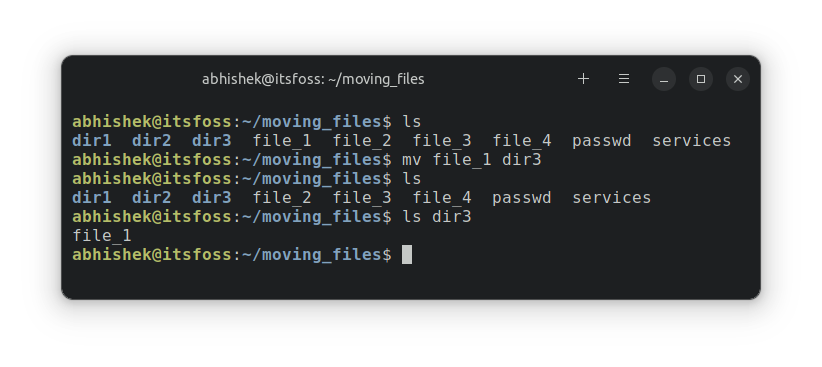
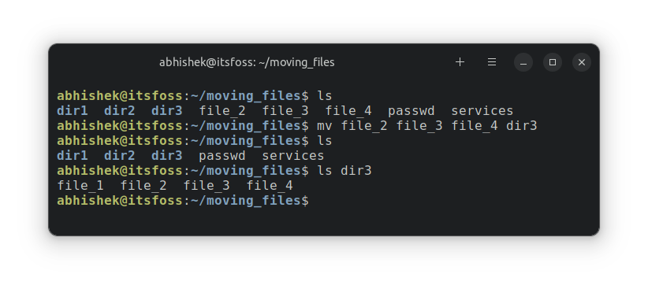
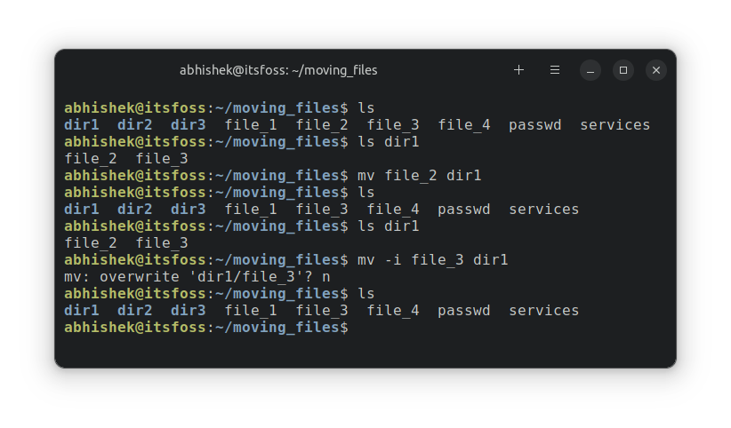
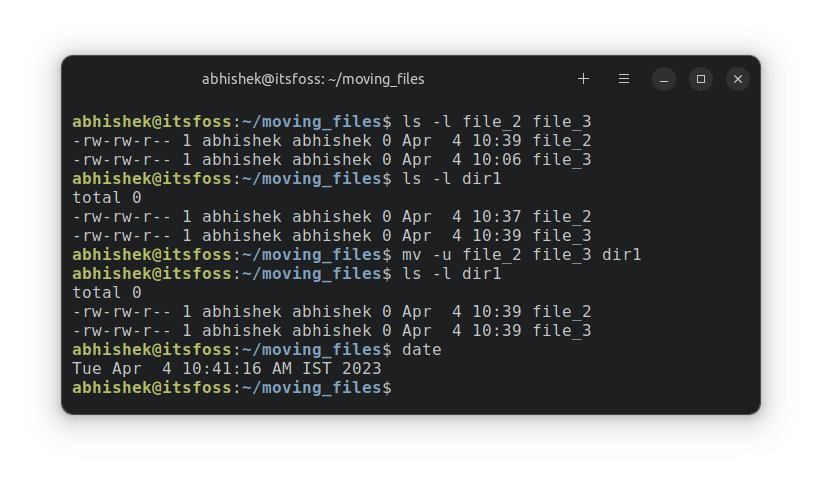
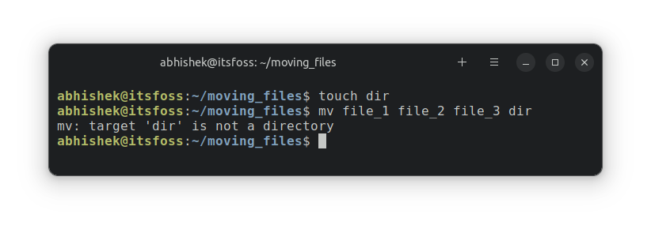
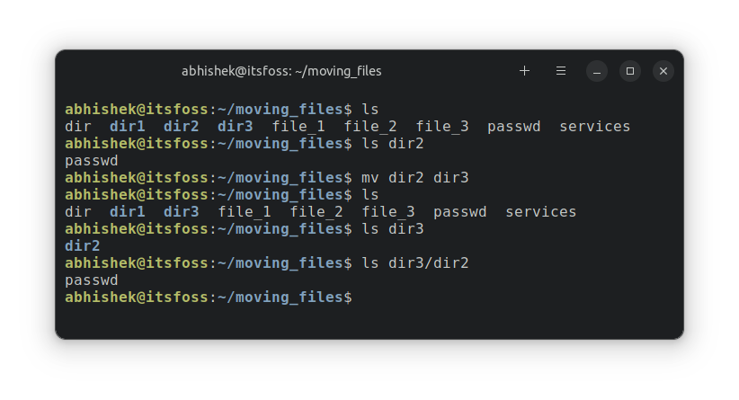
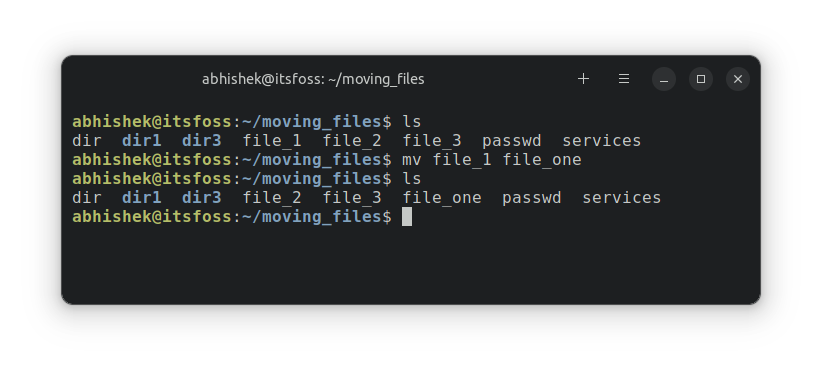

# 第 8 章：移动文件和目录（剪切粘贴操作）

>source: [https://itsfoss.com/move-files-linux/](https://itsfoss.com/move-files-linux/)
>
>作者：[Abhishek Prakash](https://itsfoss.com/author/abhishek/)
>
>译者：[DeepSeek](https://chat.deepseek.com)
>
>校对：[Churnie HXCN](https://github.com/excniesNIED)

在第八章的终端基础系列中，学习如何使用 Linux 中的 mv 命令移动文件和目录。

剪切、复制和粘贴是日常计算生活的一部分。

在前一章中，你学习了如何在终端中复制文件和文件夹（目录）。

在这一部分的终端基础系列中，你将学习如何在 Linux 终端中进行剪切-粘贴操作（移动）。

## 移动还是剪切 - 粘贴？

好吧！剪切 - 粘贴在这里不是正确的技术术语。它被称为移动文件（和文件夹）。

由于你是命令行的新手，你可能会发现“移动”这个术语令人困惑。

当你使用 `cp` 命令将文件复制到另一个位置时，源文件仍然保留在同一位置。

当你使用 `mv` 命令将文件移动到另一个位置时，源文件不再保留在原位置。

这与你在图形文件管理器中进行的剪切-粘贴操作（Ctrl + X 和 Ctrl + V）相同。

!!! note "📋"

    基本上，在命令行中移动文件可以被认为与图形环境中进行剪切-粘贴相同。

## 移动文件

Linux 有一个专门的 mv 命令（移动的缩写），用于将文件和目录移动到其他位置。

并且使用 `mv` 命令非常简单：

```Bash
mv source_file destination_directory
```

路径的作用在这里也发挥了作用。你可以使用绝对路径或相对路径。无论哪种适合你的需求。

让我们通过一个例子来看看。**你应该通过在你的系统上复制示例场景来练习**。

这是示例中的目录结构：

```Text
abhishek@itsfoss:~/moving_files$ tree
.
├── dir1
│   ├── file_2
│   └── file_3
├── dir2
│   └── passwd
├── dir3
├── file_1
├── file_2
├── file_3
├── file_4
├── passwd
└── services

3 directories, 9 files
```

现在，假设我想将 `file_1` 移动到 `dir3`。



### 移动多个文件

你可以在同一个 `mv` 命令中将多个文件移动到另一个位置：

```Bash
mv file1 file2 fileN destination_directory
```

让我们继续我们的示例场景来移动多个文件。

```Bash
mv file_2 file_3 file_4 dir3
```



!!! note "🖥️"

    将文件从 `dir3` 移回当前目录。我们接下来需要它们。

### 谨慎移动文件

如果目标位置已经有同名文件，目标文件将被立即替换。有时，你并不希望这样。

与 `cp` 命令一样，`mv` 命令也有一个交互模式，带有选项 `-i`。

目的也是相同的。在替换目标位置的文件之前请求确认。

```Bash
abhishek@itsfoss:~/moving_files$ mv -i file_3 dir1
mv: overwrite 'dir1/file_3'?
```

你可以按 N 拒绝替换，按 Y 或 Enter 替换目标文件。



### 移动但仅更新

`mv` 命令有一些特殊选项。其中之一是更新选项 `-u`。

使用这个选项，只有当被移动的文件比目标文件更新时，才会替换目标文件。

```Bash
mv -u file_name destination_directory
```

这里有一个例子。`file_2` 在 10:39 修改，`file_3` 在 10:06 修改。

```Bash
abhishek@itsfoss:~/moving_files$ ls -l file_2 file_3
-rw-rw-r-- 1 abhishek abhishek 0 Apr  4 10:39 file_2
-rw-rw-r-- 1 abhishek abhishek 0 Apr  4 10:06 file_3
```

在目标目录 `dir1` 中，`file_2` 最后在 10:37 修改，`file_3` 在 10:39 修改。

```Bash
abhishek@itsfoss:~/moving_files$ ls -l dir1
total 0
-rw-rw-r-- 1 abhishek abhishek 0 Apr  4 10:37 file_2
-rw-rw-r-- 1 abhishek abhishek 0 Apr  4 10:39 file_3
```

换句话说，在目标目录中，`file_2` 比被移动的文件旧，`file_3` 比被移动的文件新。

这也意味着 `file_3` 不会被移动，而 `file_2` 会被更新。你可以通过运行 `mv` 命令后目标目录中文件的时间戳来验证这一点。

```Bash
abhishek@itsfoss:~/moving_files$ mv -u file_2 file_3 dir1
abhishek@itsfoss:~/moving_files$ ls -l dir1
total 0
-rw-rw-r-- 1 abhishek abhishek 0 Apr  4 10:39 file_2
-rw-rw-r-- 1 abhishek abhishek 0 Apr  4 10:39 file_3
abhishek@itsfoss:~/moving_files$ date
Tue Apr  4 10:41:16 AM IST 2023
abhishek@itsfoss:~/moving_files$ 
```

正如你所见，`mv` 命令在 10:41 执行，只有 `file_2` 的时间戳被更改。



!!! question "💡"

    你也可以使用备份选项 `-b`。如果目标文件被替换，它会自动创建一个备份，文件名模式为 `filename~`。

### 故障排除：目标不是目录

如果你移动多个文件，最后一个参数必须是一个目录。否则，你会遇到这个错误：

```Text
target is not a directory
```

在这里，我创建了一个名为 `dir` 的文件。这个名字听起来像一个目录，但它是一个文件。当我尝试将多个文件移动到它时，显然会出现错误：



但如果你将一个文件移动到另一个文件呢？在这种情况下，目标文件会被源文件的内容替换，而源文件会被重命名为目标文件。更多内容将在后面的章节中介绍。

## 移动目录

到目前为止，你已经看到了关于移动文件的所有内容。那么移动目录呢？

`cp` 和 `rm` 命令使用递归选项 `-r` 来复制和删除文件夹。

然而，mv 命令没有这样的要求。你可以直接使用 mv 命令来移动目录。

```Bash
mv dir target_directory
```

这里有一个例子，我将 `dir2` 目录移动到 `dir3`。正如你所见，`dir2` 及其内容被移动到了 `dir3`。



你可以用同样的方式移动多个目录。

## 重命名文件和目录

如果你想重命名文件或目录，你可以使用相同的 `mv` 命令。

```Bash
mv filename new_name_in_same_or_new_location
```

假设你想在同一位置重命名一个文件。这里有一个例子，我将 `file_1` 重命名为 `file_one` 在同一目录中。



你也可以移动并重命名文件。你只需要提供目标目录路径和文件名。在这里，我将 `services` 文件重命名为 `my_services` 并将其移动到 `dir3`。

```Bash
abhishek@itsfoss:~/moving_files$ ls
dir  dir1  dir3  file_2  file_3  file_one  passwd  services
abhishek@itsfoss:~/moving_files$ mv services dir3/my_services
abhishek@itsfoss:~/moving_files$ ls dir3
dir2  my_services
```

!!! note "📋"

    你不能直接使用 mv 命令重命名多个文件。你必须将其与其他命令（如 find 等）结合使用。

## 📝 测试你的知识

是时候练习你刚刚学到的内容了。

创建一个新的文件夹来练习。在这里，创建一个如下的目录结构：

```Text
.
├── dir1
├── dir2
│   ├── dir21
│   ├── dir22
│   └── dir23
└── dir3
```

将文件 `/etc/passwd` 复制到当前目录。现在将其重命名为 `secrets`。

创建三个新文件，命名为 `file_1`、`file_2` 和 `file_3`。将所有文件移动到 `dir22`。

现在将 `dir22` 目录移动到 `dir3`。

现在删除 `dir2` 中的所有内容。

在终端基础系列的倒数第二章中，你将学习如何在终端中编辑文件。敬请期待。