# 终端基础：在 Linux 终端中编辑文件

>source: [https://itsfoss.com/edit-files-linux/](https://itsfoss.com/edit-files-linux/)
>
>作者：[Abhishek Prakash](https://itsfoss.com/author/abhishek/)
>
>译者：[DeepSeek](https://chat.deepseek.com)
>
>校对：[Churnie HXCN](https://github.com/excniesNIED)

学习在 Linux 终端中使用适合初学者的 Nano 编辑器编辑文本文件，在本系列倒数第二章中。

到目前为止，在这个终端基础系列中，你已经学习了许多文件操作。你学会了创建新文件、删除现有文件以及复制和移动文件。

现在是时候更上一层楼了。让我们看看如何在 Linux 终端中编辑文件。

如果你正在编写 bash shell 脚本，你可以使用 Gedit 等 GUI 文本编辑器并在终端中运行它们。

但有时，你会发现自己需要直接在终端中编辑现有文件。例如，修改位于 `/etc` 目录中的配置文件。

作为桌面 Linux 用户，即使是以 root 身份，你仍然可以使用 GUI 编辑器来编辑配置文件。我稍后会展示给你看。

然而，知道如何在命令行中编辑文件会更好。

## 在 Linux 终端中编辑文件

如果你只需要在现有文件的底部添加几行，可以使用 `cat` 命令。但为了正确编辑文件，你需要一个合适的文本编辑器。

Linux 中根本不缺少 [基于终端的文本编辑器](https://fosscope.com/20240729-9-best-text-editors-for-the-linux-command-line)。**Vi、Vim、Nano、Emacs 只是其中最受欢迎的几个。**

但问题是，所有这些编辑器都有学习曲线。你没有 GUI 的舒适感。你没有菜单可以用鼠标与编辑器交互。

相反，**你必须使用（并记住）键盘快捷键。**

我发现 Nano 对新用户来说是一个很好的起点。它是 Ubuntu 和许多其他 Linux 发行版的默认文本编辑器。

当然，也有学习曲线，但没有 Vim 或 Emacs 那么陡峭。它一直在底部显示最相关的键盘快捷键。这有助于你导航，即使你不记得确切的快捷键。

因此，我将在这里介绍 Nano 编辑器的基本知识。你将**学习所有需要知道的基本知识**，以便开始使用 Nano 在 Linux 终端中编辑文件。

## 使用 Nano 编辑器

Nano 可以用来编辑文本文件、脚本文件、程序文件等。请记住，**它不是文字处理器**，不能用来编辑文档或 PDF 文件。对于简单的配置文件、脚本或文本文件的文本编辑，Nano 是一个很好的选择。

!!! question "🚧"

    你应该在你的系统上安装了 Nano 才能跟随本教程。

我将使用一个名为 `agatha_complete.txt` 的文本文件。它包含了阿加莎·克里斯蒂所有书籍的名称。如果你计划在你的系统上跟随步骤，可以从这个链接下载它。

https://ed.qcea.top/d/ChaIndex/Space/excnies/public/sdnuroboticsailab-doc/agatha_complete.txt

### 探索 Nano 编辑器界面

使用以下命令打开 Nano 编辑器：

```Bash
nano
```

你会注意到你的终端中出现了一个新的界面，显示为 GNU nano 并显示 *New Buffer*。***New Buffer* 意味着 Nano 正在处理一个新文件。**

这相当于在一个文本编辑器中打开一个未保存的新文件，比如 Gedit 或 Notepad。

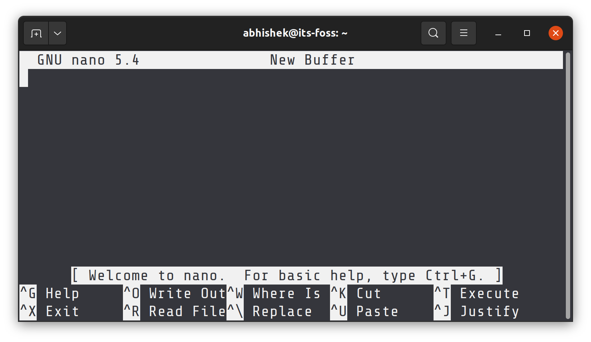
*Nano 编辑器界面*

Nano 编辑器在编辑器的底部显示了你需要使用的基本键盘快捷键。这样，你就不会像在 Vim 中那样卡在退出编辑器上。

终端窗口越宽，它显示的快捷键就越多。

你应该熟悉 Nano 中的符号。

- **插入符号符号 (^) 表示 Ctrl 键**
- **M 字符表示 Alt 键**

!!! note "📋"

    当它说 `^X Exit` 时，意味着使用 `Ctrl + X` 键退出编辑器。当它说 `M-U Undo` 时，意味着使用 `Alt + U` 键撤销你的最后操作。

还有一件事。它在键盘上显示大写字母。但这并不意味着大写字符。^X 意味着键盘上的 Ctrl  +  x 键，而不是 Ctrl + Shift + x 键（为了得到大写的 X）。

你也可以通过按 Ctrl + G 在编辑器内部获得详细的帮助文档。

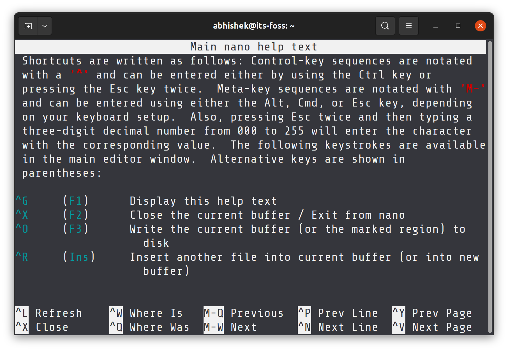
*按 Ctrl + G 调出 Nano 中的帮助菜单*

现在你已经对界面有了一些了解，用 Ctrl + X 键退出 Nano 编辑器。由于你没有对这个未保存的文件做任何更改，所以不会被要求保存它。

太棒了！你现在对编辑器有了一些了解。在下一部分，你将学习如何用 Nano 创建和编辑文件。

### 在 Nano 中创建或打开文件

你可以这样在 Nano 中打开一个文件进行编辑：

```Bash
nano filename
```

如果文件不存在，它仍然会打开编辑器，当你退出时，你将有保存文本到 my_file 的选项。

你也可以不带任何名称地打开一个新文件（像新文档一样），像这样：

```Bash
nano
```

试试看。在终端中，只需写 `nano` 并按回车。

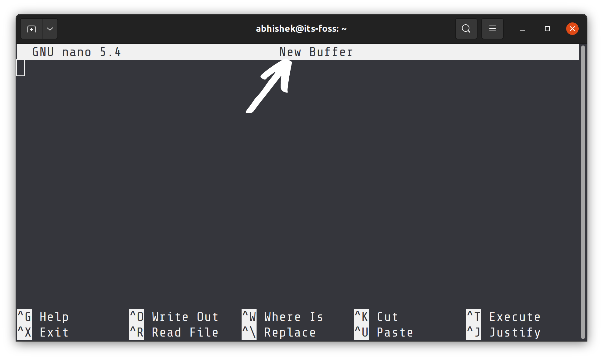
*Nano 中的新文件*

你注意到“New Buffer”了吗？因为你没有给文件任何名称，所以它表示这是一个新的、未保存的文件在内存缓冲区中。

你可以直接在 Nano 中开始写入或修改文本。没有特殊的插入模式或类似的东西。它几乎就像使用一个普通的文本编辑器，至少对于写入和编辑来说是这样。

如果你对文件（新的或现有的）做了任何更改，你会注意到文件名或 New Buffer 旁边会出现一个星号（*）（表示一个新的、未保存的文件）。

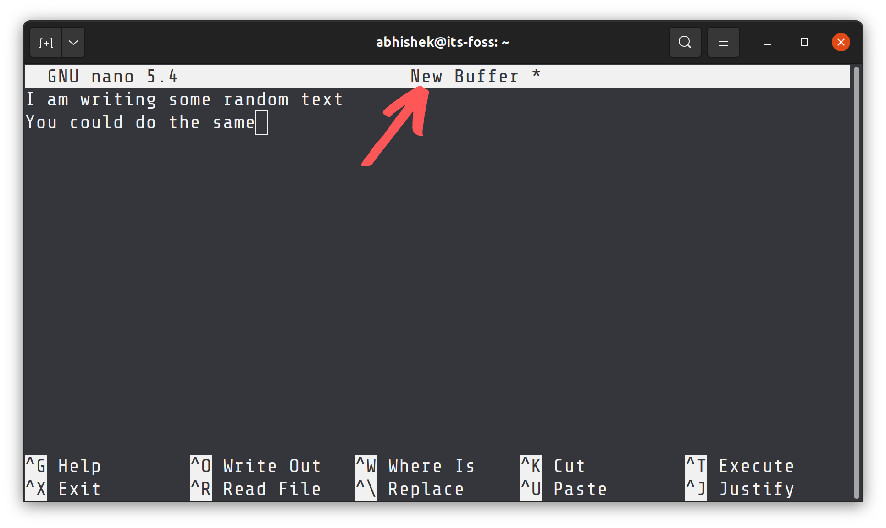
*星号表示文件有未保存的更改*

看起来不错。在下一部分，你将看到如何保存文件并退出 Nano 编辑器界面。

### 在 Nano 中保存和退出

除非你明确这样做，否则什么都不会立即保存到文件中。当你**使用 Ctrl + X 键盘快捷键退出编辑器**时，你会被问是否要保存文件。

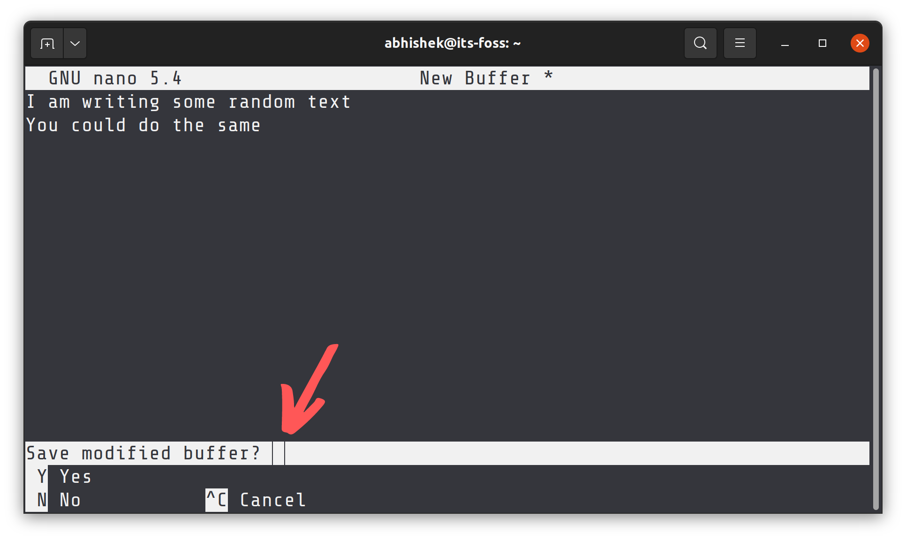

- **Y** 保存文件并退出编辑器
- **N** 放弃更改
- **C** 取消保存但继续编辑

如果你选择通过按 Y 键保存文件，你会被要求给文件命名。命名为 `my_file.txt`。

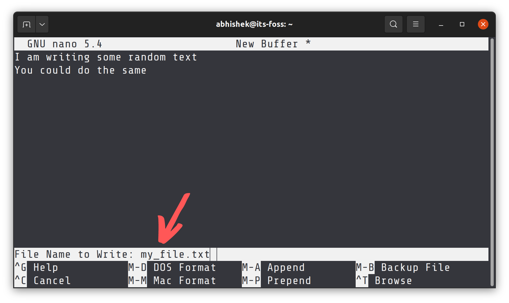

!!! note "📋"

    .txt 扩展名不是必需的，因为即使你不使用扩展名，文件已经是文本文件。然而，为了便于理解，保持文件扩展名是一个好习惯。

输入名称并按回车键。你的文件将被保存，你将退出 Nano 编辑器界面。你可以看到文本文件已经在你的当前目录中创建。

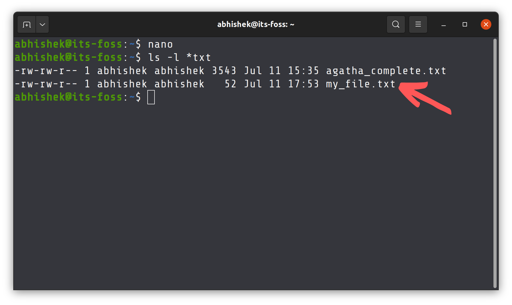

!!! note "📋"

    如果你习惯于在文本编辑器中使用 Ctrl + S 保存文件，并且你在 Nano 中无意识地按下它，什么都不会发生。为什么“什么都不会发生”很重要？因为如果你在 Linux 终端中按下 Ctrl + S，它会冻结输出屏幕，你不能输入或做任何事情。你可以通过按 Ctrl + Q 从这种“冻结的终端”中恢复。

### 在 Nano 中执行“另存为”操作

在 Gedit 或 Notepad 中，你有一个“另存为”选项，可以将对现有文件所做的更改保存为新文件。这样，原始文件保持不变，你创建一个带有修改文本的新文件。

你也可以在 Nano 编辑器中这样做，而且好消息是你不需要记住另一个键盘快捷键。你可以使用与保存和退出相同的 Ctrl + X 键。

让我们看看它的实际操作。打开你之前下载的示例文件。

```Bash
nano agatha_complete.txt
```

如果你不做任何更改，Ctrl + X 将简单地关闭编辑器。你不想那样，对吧？

所以只需按回车键，然后按退格键。这将插入一个新行，然后删除它。这样，文本文件中的内容没有改变，但 Nano 会将其视为修改过的文件。

如果你按下 Ctrl + X 并按 Y 确认保存，你会来到显示文件名的屏幕。你可以在这里通过按退格键并输入新名称来更改文件名。

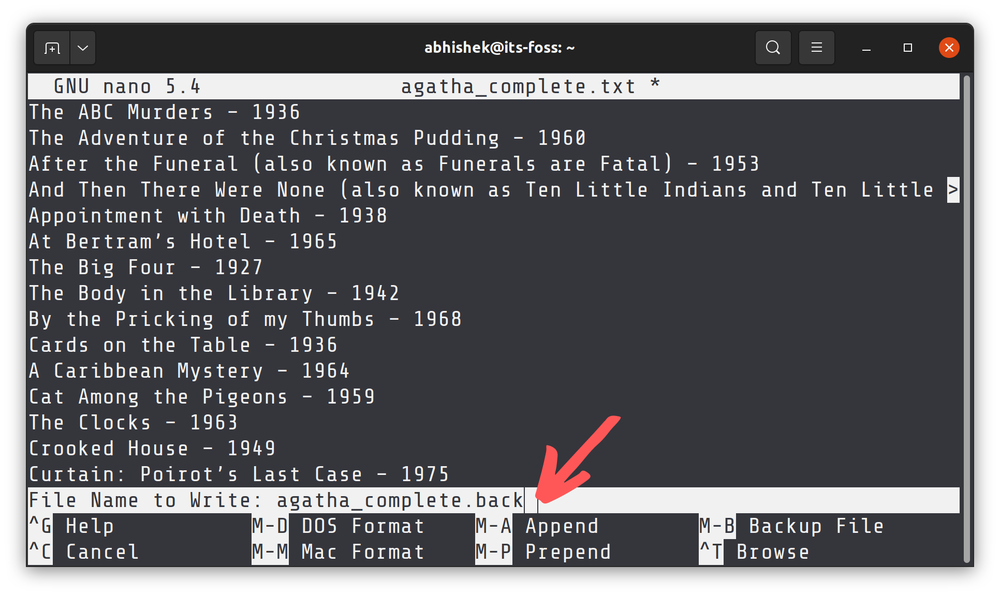

它会问你是否确认用不同的名称保存。按 Y 确认这个决定。

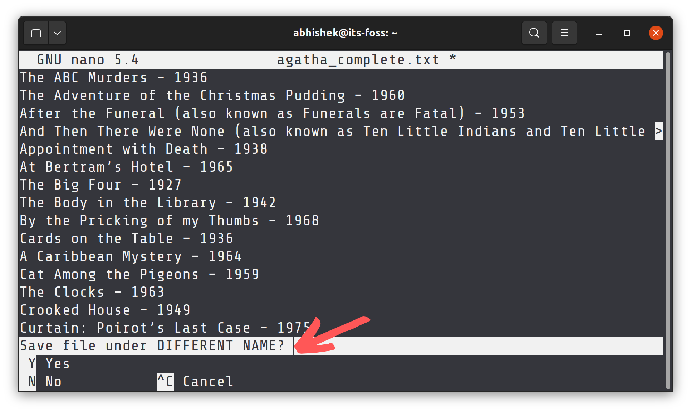

我将其命名为 agatha_complete.back，表示它是同名文件的“备份”。这只是为了方便。.back 扩展名背后没有实际意义。

所以，你已经学会了在本课中用 Nano 保存文件。在下一部分，你将学习如何在文本文件中移动。

### 在文件中移动

用 Nano 打开 agatha_complete.txt 文件。你知道如何用 Nano 编辑器打开文件，对吧？

```Bash
nano agatha_complete.txt
```

现在你有一个包含多行的文本文件。如何切换到其他行或下一页或行尾？

鼠标点击在这里不起作用。使用箭头键上下左右移动。

你可以使用 Home 键或 Ctrl + A 移动到行首，使用 End 键或 Ctrl + E 移动到行尾。Ctrl + Y/Page Up 和 Ctrl + V/Page Down 键可以用来按页滚动。

- 使用箭头键移动
- 使用 Ctrl + A 或 Home 键移动到行首
- 使用 Ctrl + E 或 End 键移动到行尾
- 使用 Ctrl + Y 或 Page Up 键向上滚动一页
- 使用 Ctrl + V 或 Page Down 键向下滚动一页

你没有对文件做任何更改。退出它。

现在，用这个命令再次打开同一个文件：

```Bash
nano -l agatha_complete.txt
```

你注意到有什么不同吗？`-l` 选项在左侧显示行号。

我为什么要展示给你看？因为我希望你现在学习如何跳转到特定行。为此，使用 Ctrl + _（下划线）键组合。

!!! note "📋"

    The Help options get changed at the bottom. That’s the beauty of Nano. If you choose a special keyboard shortcut, it starts showing the options that can be used with that key combination.

在上图中，你可以输入行号或列号。同时，它显示你可以输入 Ctrl + Y 跳转到文件的第一行（这与向上滚动一页的常规 Ctrl + Y 不同）。

使用 Ctrl + T 在同一屏幕上，你可以跳转到某个文本。这几乎就像搜索特定文本一样。

这就把我们带到了下一部分的主题，即搜索和替换。

### 搜索和替换

你仍然打开了示例文本文件，对吧？如果没有，再次打开它。让我们看看如何搜索文本并将其替换为其他内容。

如果你想搜索某个文本，使用 **Ctrl  +  W**，然后输入你要搜索的术语并按回车。光标将移动到第一个匹配项。要转到下一个匹配项，使用 **Alt  +  W** 键。

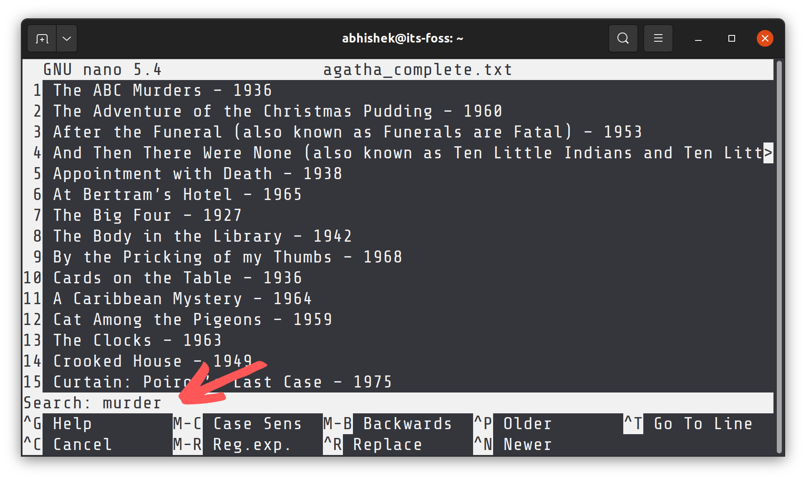

默认情况下，搜索是不区分大小写的。你可以通过在即将进行搜索时按 **Alt  +  C** 来进行区分大小写的搜索。

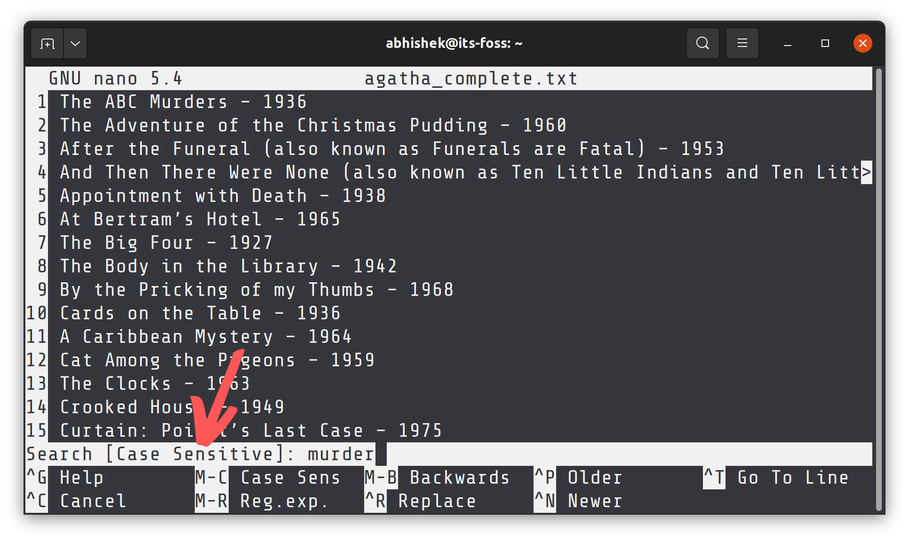

再次注意底部可以使用的选项。还要注意它显示了括号内的最后一个搜索项。

同样，你也可以通过按 **Alt + R** 使用正则表达式进行搜索。

最后，**使用 Ctrl + C 退出搜索模式**。

如果你想替换搜索到的术语，使用 **Ctr + \\** 键，然后输入搜索项并按回车键。

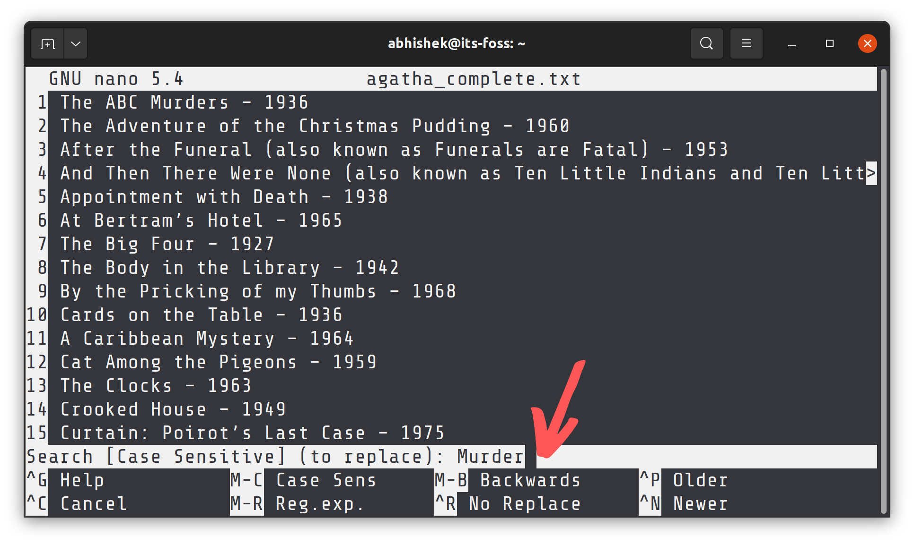

接下来，它会问你想要用什么术语替换搜索到的项目。

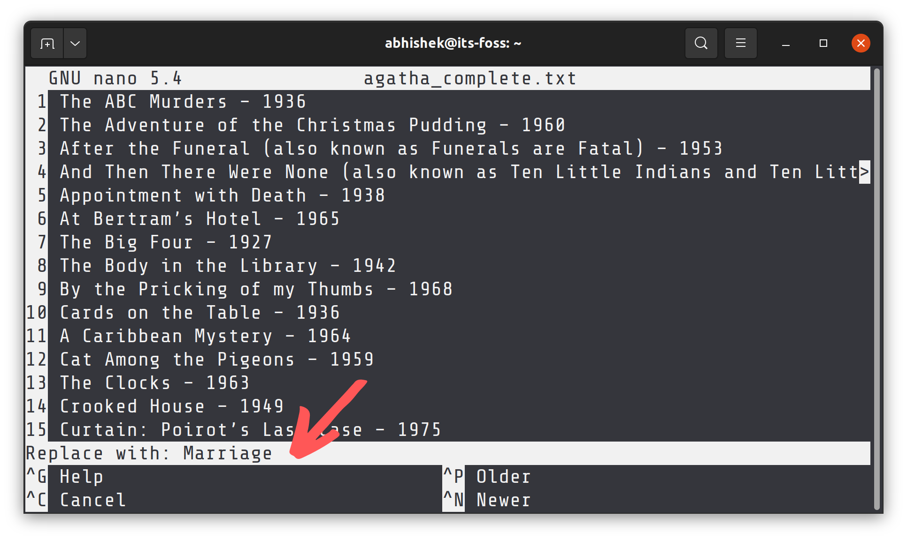

光标将移动到第一个匹配项，Nano 会询问你是否确认替换匹配的文本。使用 Y 或 N 确认或拒绝。使用 Y 或 N 中的任何一个都会移动到下一个匹配项。你也可以使用 A 替换所有匹配项。

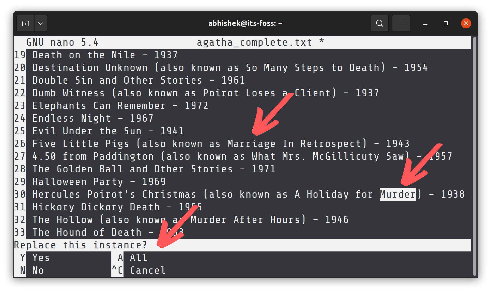

在上面的文本中，我已经替换了术语 Murder 的第二次出现为 Marriage，然后它询问我是否要替换下一个出现的内容。

**使用 Ctrl + C 停止搜索和替换。**

你在这节课中对文本文件做了一些更改。但没有必要保存这些更改。按 Ctrl + X 退出，但不要选择保存选项。

在下一部分，你将学习如何剪切、复制和粘贴。

### 剪切、复制和粘贴文本

首先打开示例文本文件。

!!! question "💡"

    如果你不想花太多时间记住快捷键，可以使用鼠标。

用鼠标选择文本，然后使用右键菜单复制文本。你也可以在 [Ubuntu 终端中使用键盘快捷键](https://cn.linux-console.net/?p=18791) Ctrl + Shift + C。同样，你可以使用右键菜单并选择粘贴，或者使用 Ctrl + Shift + V 键组合。

Nano 也提供了自己的快捷键来剪切和粘贴文本，但这可能会让初学者感到困惑。

将光标移动到你要复制的文本的开头。按 Alt + A 设置标记。现在使用箭头键突出显示选择。

一旦你选择了所需的文本，你可以使用 Alt + 6 键复制选定的文本，或者使用 Ctrl + K 剪切选定的文本。使用 Ctrl + 6 取消选择。

一旦你复制或剪切了选定的文本，你可以使用 Ctrl + U 粘贴它。

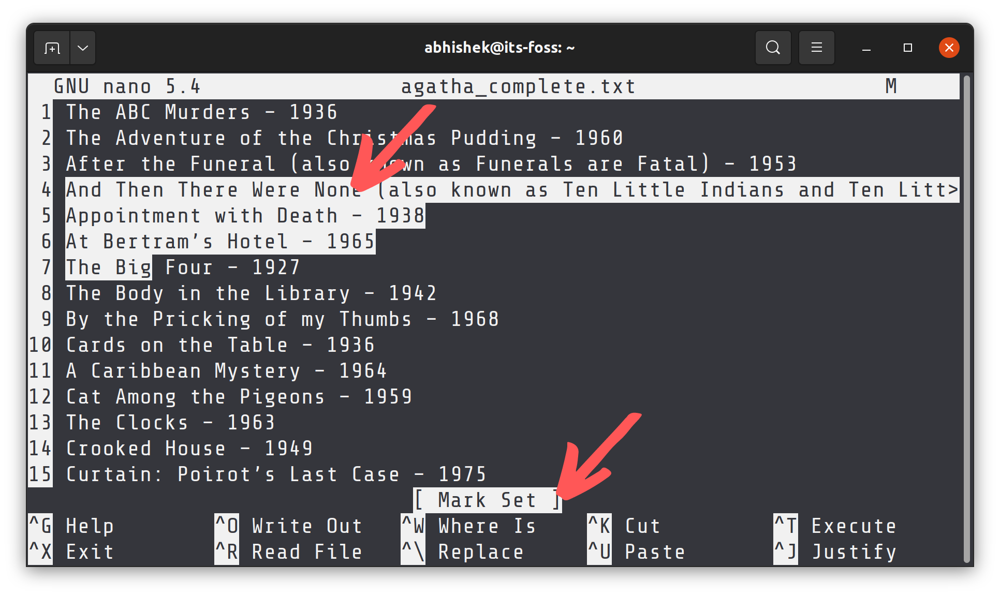

如果你不想继续选择文本或复制它，再次使用 Alt + A 取消标记。

回顾一下：

- 你可以在大多数 Linux 终端中使用 Ctrl + Shift + C 复制和 Ctrl + Shift + V 粘贴剪贴板的内容。
- 或者，使用 Alt + A 设置标记，使用箭头键移动选择，然后使用 Alt + 6 复制，Ctrl + k 剪切和 Ctrl + 6 取消。
- 使用 Ctrl + U 粘贴复制的或剪切的文本。

现在你知道了关于复制粘贴的内容。下一部分将教你一些关于在 Nano 中删除文本和行的内容。

### 删除文本或行

Nano 中没有专门的删除选项。你可以使用 Backspace 或 Delete 键一次删除一个字符。反复按它们或按住它们删除多个字符。就像在任何常规文本编辑器中一样。

你也可以使用 Ctrl + K 键剪切整行。如果你不粘贴它，它就像删除一行一样。

如果你想删除多行，你可以对所有这些行逐个使用 Ctrl + K。

另一个选项是使用标记（Ctrl + A）。设置标记并使用箭头键选择一部分文本。使用 Ctrl + K 剪切文本。不需要粘贴它，选定的文本将被删除（在某种程度上）。

### 撤销和重做

剪切了错误的行？粘贴了错误的文本选择？很容易犯这些愚蠢的错误，也很容易纠正这些愚蠢的错误。

你可以使用以下方法撤销和重做你的最后操作：

- **Alt + U : 撤销**
- **Alt + E : 重做**

你可以重复这些键组合多次撤销或重做。

## 差不多结束了...

如果你觉得 Nano 让人不知所措，你应该尝试 Vim 或 Emacs。你会开始喜欢 Nano。

[每个 Linux 用户必须知道的基本 Vim 命令 [附 PDF 备忘单]](https://cn.linux-console.net/?p=20186)

这是 Emacs 的一个很好的入门教程。如果你想尝试的话，可以试试看。

[基本 Emacs 命令详细解释](https://cn.linux-console.net/?p=20156)

无论 Nano 多么适合初学者，有些人可能会觉得在终端中编辑重要文件的想法令人畏惧。

如果你使用的是可以访问 GUI 编辑器的 Linux 桌面，你可以使用它以 root 身份编辑那些重要文件。

比如说，你的系统上安装了 Gedit，你需要以 root 身份编辑 SSH 配置文件。你可以像这样从终端以 root 身份运行 Gedit ：

```Bash
sudo gedit /etc/ssh/ssh_config
```

它将以 root 身份打开一个 Gedit 实例。命令在终端中持续运行。进行你的更改并保存文件。当你保存并关闭 Gedit 时，它会显示警告消息。

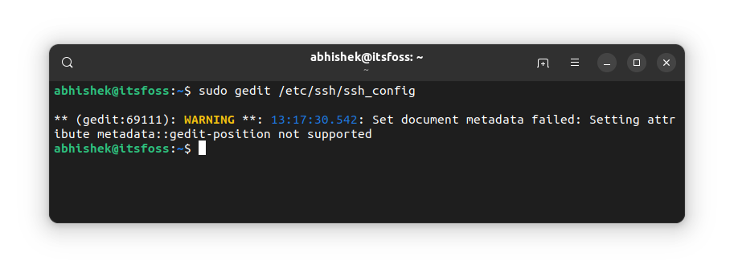

我们即将结束我们的终端基础系列。在系列的第十章也是最后一章中，你将学习如何在 Linux 终端中获取帮助。

现在，如果你遇到任何问题，请在评论部分告诉我。