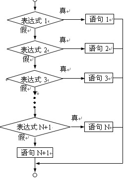
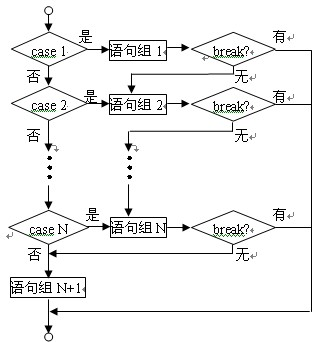
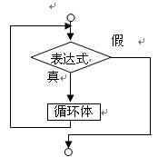
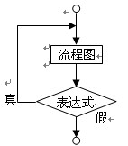
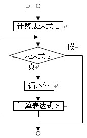

# 控制流语句

> 原文：[C++ Control Flow](https://en.cppreference.com/w/cpp/language/statements)
>
> 译者：RAAI学习团队

控制流语句允许程序根据特定条件执行不同的代码块，或重复执行某段代码。C++ 主要提供了两种类型的控制流语句：**条件语句**和**循环语句**。

-----

## **一、条件语句**

条件语句根据一个表达式的真假来决定执行哪个代码分支。

### **1. if 语句**

`if` 语句是最基础的条件判断工具。它评估一个条件，如果为真，则执行紧随其后的代码块。它可以单独使用，也可以与 `else` 或 `else if` 配合，形成更复杂的逻辑判断。

**流程图：**



**基本语法：**

```cpp
// 单 if 语句
if (condition) {
    statement;
}

// if-else 语句
if (condition) {
    statement_if_true;
} else {
    statement_if_false;
}

// if-else if-else 结构
if (condition1) {
    statement1;
} else if (condition2) {
    statement2;
} else {
    default_statement;
}
```

  * **condition**：必须用小括号 `()` 包围，其结果必须能转换为 `bool` 类型。
  * **statement**：如果只有单条语句，可以省略大括号 `{}`，但为了清晰和避免错误，推荐总是使用大括号。

**示例代码：**

```cpp
#include <iostream>

int main() {
    int age = 18;

    // 简单的 if 语句
    if (age >= 18) {
        std::cout << "You are an adult." << std::endl;
    }

    // if-else 语句
    int score = 88;
    if (score >= 60) {
        std::cout << "Passed." << std::endl;
    } else {
        std::cout << "Failed." << std::endl;
    }

    // if-else if-else 语句
    if (age < 13) {
        std::cout << "You are a child." << std::endl;
    } else if (age < 18) {
        std::cout << "You are a teenager." << std::endl;
    } else if (age < 65) {
        std::cout << "You are an adult." << std::endl;
    } else {
        std::cout << "You are a senior." << std::endl;
    }

    return 0;
}
```

**注意：悬垂 `else` 问题**

在嵌套 `if` 语句中，`else` 会与最近的、尚未配对的 `if` 结合。这可能导致逻辑错误。

**错误示例：**

```cpp
// 意图：grade % 10 > 7 加 '+', grade % 10 在 [3, 7] 区间加 '-'
if (grade % 10 >= 3)
    if (grade % 10 > 7)
        lettergrade += '+';
else // 这个 else 实际与 if(grade % 10 > 7) 配对
    lettergrade += '-';
```

**正确做法：** 使用大括号明确代码块，避免歧义。

```cpp
if (grade % 10 >= 3) {
    if (grade % 10 > 7) {
        lettergrade += '+';
    } else {
        lettergrade += '-';
    }
}
```

### **2. switch 语句**

`switch` 语句提供了一种在多个固定选项中进行选择的便捷方式。它计算一个表达式的值，并与一系列 `case` 标签进行比较。

**流程图：**



**基本语法：**

```cpp
switch (expression) {
    case constant_expression1:
        statement1;
        break;
    case constant_expression2:
        statement2;
        break;
    // ...
    default:
        default_statement;
        break;
}
```

**关键特性：**

1.  `expression` 的值必须是整数类型或可以转换为整数类型。
2.  程序会从匹配的 `case` 标签开始执行，并**继续执行**后续所有 `case` 的代码，直到遇到 `break` 语句或 `switch` 结构结束。这种特性被称为“穿透”（fallthrough）。
3.  `break` 语句用于跳出 `switch` 结构，通常在每个 `case` 块末尾都需要。
4.  `default` 标签是可选的，当没有任何 `case` 匹配时，将执行 `default` 后的代码。

**示例代码：**

```cpp
#include <iostream>

int main() {
    int day = 3;
    switch (day) {
        case 1:
            std::cout << "Monday" << std::endl;
            break;
        case 2:
            std::cout << "Tuesday" << std::endl;
            break;
        case 3:
            std::cout << "Wednesday" << std::endl;
            break;
        case 4:
            std::cout << "Thursday" << std::endl;
            break;
        case 5:
            std::cout << "Friday" << std::endl;
            break;
        case 6:
        case 7: // 多个 case 共享同一代码块
            std::cout << "Weekend" << std::endl;
            break;
        default:
            std::cout << "Invalid day" << std::endl;
            break;
    }
    return 0;
}
```
### 3. 三元条件运算符 (?:)
除了 if 和 switch ，C++ 还提供了一种更紧凑的条件表达式形式——三元条件运算符。它可以在一行内完成简单的 if-else 判断，非常适合用于赋值操作。

基本语法：

```cpp
some_val = condition ? expression_if_true : expression_if_false;
```
- 如果 `condition` 为真，整个表达式的值为 `expression_if_true` 。
- 如果 `condition` 为假，整个表达式的值为 `expression_if_false` 。
示例代码：

```cpp
#include <iostream>
#include <string>

int main() {
    int score = 85;
    std::string result = (score >= 60) ? "Passed" : "Failed";

    std::cout << "The result is: " << result << std::endl;

    return 0;
}
```
这行代码等效于：

```cpp
std::string result;

if (score >= 60) {
    result = "Passed";
} else {
    result = "Failed";
}
```
三元运算符让代码更简洁，但对于复杂的逻辑，还是推荐使用 if-else 结构以保证可读性。
-----

## **二、循环语句**

循环语句允许代码块被重复执行。

### **1. while 循环**

当不确定迭代次数，但知道循环继续的条件时，`while` 循环是理想选择。它在每次迭代前检查条件，只有当条件为真时才执行循环体。

**流程图：**



**基本语法：**

```cpp
while (condition) {
    statement;
}
```

  * 如果 `condition` 首次求值即为 `false`，循环体一次也不会执行。

**示例代码：**

```cpp
#include <iostream>

int main() {
    int count = 0;
    while (count < 5) {
        std::cout << "Count: " << count << std::endl;
        count++;
    }
    return 0;
}
```

### **2. do-while 循环**

与 `while` 循环类似，但它保证循环体**至少执行一次**，因为它在循环体执行完毕后才检查条件。

**流程图：**



**基本语法：**

```cpp
do {
    statement;
} while (condition);
```

**示例代码：**

```cpp
#include <iostream>

int main() {
    int number;
    do {
        std::cout << "Enter a positive number: ";
        std::cin >> number;
    } while (number <= 0);

    std::cout << "You entered: " << number << std::endl;
    return 0;
}
```

### **3. for 循环**

`for` 循环是 C++ 中最常用的循环结构，特别适合在迭代次数已知的情况下使用。

**流程图：**



**传统 `for` 循环语法：**

```cpp
for (init_statement; condition; expression) {
    statement;
}
```

  * **init\_statement**：初始化语句，在循环开始前执行一次。可以声明具有相同类型的多个变量。
  * **condition**：循环条件，每次迭代前检查。若为 `false`，循环终止。
  * **expression**：迭代表达式，在每次循环体执行后执行，通常用于更新循环变量。

**范围 `for` 循环 (C++11 及以上):**
这是一种更简洁的语法，用于遍历一个序列（如数组、`std::vector`、`std::string` 或初始化列表）中的所有元素。

**基本语法：**

```cpp
for (declaration : expression) {
    statement;
}
```

**示例代码：**

```cpp
#include <iostream>
#include <vector>

int main() {
    // 传统 for 循环
    for (int i = 0; i < 5; i++) {
        std::cout << "i = " << i << std::endl;
    }

    // 范围 for 循环遍历数组
    int numbers[] = {1, 2, 3, 4, 5};
    for (int num : numbers) {
        std::cout << "num = " << num << std::endl;
    }
    
    // 范围 for 循环遍历 std::vector
    std::vector<int> my_vec = {1, 2, 3};
    int sum = 0;
    for (int n : my_vec) {
        sum += n;
    }
    std::cout << "Sum: " << sum << std::endl;

    return 0;
}
```

-----

## **三、循环控制语句**

`break` 和 `continue` 语句用于在循环内部改变其正常的执行流程。

### **1. break 语句**

`break` 语句会立即**终止**离它最近的 `while`、`do-while`、`for` 循环或 `switch` 语句。程序将从被终止语句之后的第一行代码继续执行。

### **2. continue 语句**

`continue` 语句会**跳过当前迭代中余下的代码**，并立即开始下一次迭代。

  * 在 `for` 循环中，它会先执行迭代表达式，然后检查条件。
  * 在 `while` 和 `do-while` 循环中，它会直接跳转到条件判断部分。

**示例代码：**

```cpp
#include <iostream>

int main() {
    // break 示例
    std::cout << "--- break example ---" << std::endl;
    for (int i = 0; i < 10; i++) {
        if (i == 5) {
            std::cout << "Breaking at i = 5" << std::endl;
            break; // 当 i 等于 5 时退出循环
        }
        std::cout << "i = " << i << std::endl;
    }

    // continue 示例
    std::cout << "\n--- continue example ---" << std::endl;
    for (int i = 0; i < 5; i++) {
        if (i % 2 != 0) {
            continue; // 跳过奇数，不打印
        }
        std::cout << "Even number: " << i << std::endl;
    }

    return 0;
}
```

-----

## **四、嵌套与实践**

### **嵌套控制流**

任何控制流语句都可以嵌套在另一个内部，以实现更复杂的逻辑。这在处理多维数据或分层条件时非常有用。

#### **1. 条件语句嵌套**

一个 `if` 或 `if-else` 语句可以包含在另一个 `if` 语句的代码块中，形成嵌套结构。这允许你基于一个条件的结果，再进行更细致的判断。

**示例代码：**

```cpp
#include <iostream>

int main() {
    int age = 20;
    bool has_license = false;

    if (age >= 18) {
        std::cout << "Age requirement met." << std::endl;
        if (has_license) {
            std::cout << "You can legally drive." << std::endl;
        } else {
            std::cout << "You need a driver's license to drive." << std::endl;
        }
    } else {
        std::cout << "You are not old enough to drive." << std::endl;
    }

    return 0;
}
```

#### **2. 循环语句嵌套**

一个循环可以完整地存在于另一个循环的内部。外层循环每执行一次，内层循环会完整地执行一遍。这常用于处理二维数组、打印图案或生成表格。

**示例代码（打印乘法表）：**

```cpp
#include <iostream>
#include <iomanip> // 用于设置输出格式

int main() {
    for (int i = 1; i <= 9; ++i) {       // 外层循环控制行
        for (int j = 1; j <= i; ++j) { // 内层循环控制列
            std::cout << j << " * " << i << " = " << std::left << std::setw(2) << i * j << "  ";
        }
        std::cout << std::endl; // 每行结束后换行
    }
    return 0;
}
```

### **如何让程序“崩溃”（常见错误）**

1.  **无限循环**：忘记更新循环条件变量。
    ```cpp
    while (true) { /* ... */ } // 忘记 break
    for (int i = 0; i < 10; ) { /* 忘记 i++ */ }
    ```
2.  **`switch` 中缺少 `break`**：导致意外的“穿透”执行。
    ```cpp
    switch (day) {
        case 1:
            std::cout << "Monday"; // 没有 break，会继续执行 case 2
        case 2:
            std::cout << "Tuesday";
            break;
    }
    ```
3.  **逻辑错误**：将比较 `==` 误写为赋值 `=`。
    ```cpp
    int x = 5;
    if (x = 10) { // x 被赋值为 10，条件永远为真
        std::cout << "x is 10" << std::endl;
    }
    ```

-----

## **五、拓展学习**

### **外部研究**

1.  **`goto` 语句**：了解其语法和使用场景，但注意它通常不被推荐，因为它会破坏代码结构。
2.  **异常处理**：学习 `try`、`catch`、`throw` 机制，用于处理程序运行时的错误。
3.  **C++17 新特性**：
      * **`if constexpr`**：在编译时进行条件判断。
      * **结构化绑定**：允许使用 `auto` 同时声明和初始化多个变量，通常用于解包元组或结构体。

### **附加题**

1.  使用嵌套循环打印一个乘法表。
2.  使用 `switch` 语句实现一个简单的加、减、乘、除计算器。
3.  编写一个程序，清晰地演示 `while`、`do-while` 和 `for` 循环之间的区别。
4.  研究并总结 `goto` 语句的适用场景和潜在问题。
5.  掌握异常处理（`try-catch`）的基本语法并编写示例。

-----
## 最后提要
本节所有示例程序可以在`program.cpp`中找到  
你可以通过下面的命令编译（假设你是用gcc编译器）
```sh
g++ program.cpp -o main
```
你可以通过下面的命令运行程序
```sh
./main
```
你会得到
```sh
--- if_statement_example ---
You are an adult.
Passed.
You are an adult.

--- dangling_else_example ---
Initial grade: 78, lettergrade: B
Final lettergrade (incorrect logic): B+
Final lettergrade (correct logic): B+

--- switch_statement_example ---
Wednesday

--- ternary_operator_example ---
The result is: Passed

--- while_loop_example ---
Count: 0
Count: 1
Count: 2
Count: 3
Count: 4

--- do_while_loop_example ---
Enter a positive number: 5 (simulated input)
You entered: 5

--- for_loop_example ---
Traditional for loop:
i = 0
i = 1
i = 2
i = 3
i = 4

Range-based for loop with array:
num = 1
num = 2
num = 3
num = 4
num = 5

Range-based for loop with vector:
Sum: 6

--- break_continue_example ---
--- break example ---
i = 0
i = 1
i = 2
i = 3
i = 4
Breaking at i = 5

--- continue example ---
Even number: 0
Even number: 2
Even number: 4

--- nested_conditional_example ---
Age requirement met.
You need a driver's license to drive.

--- nested_loop_example ---
1 * 1 = 1
1 * 2 = 2   2 * 2 = 4
1 * 3 = 3   2 * 3 = 6   3 * 3 = 9
1 * 4 = 4   2 * 4 = 8   3 * 4 = 12  4 * 4 = 16  
1 * 5 = 5   2 * 5 = 10  3 * 5 = 15  4 * 5 = 20  5 * 5 = 25
1 * 6 = 6   2 * 6 = 12  3 * 6 = 18  4 * 6 = 24  5 * 6 = 30  6 * 6 = 36
1 * 7 = 7   2 * 7 = 14  3 * 7 = 21  4 * 7 = 28  5 * 7 = 35  6 * 7 = 42  7 * 7 = 49  
1 * 8 = 8   2 * 8 = 16  3 * 8 = 24  4 * 8 = 32  5 * 8 = 40  6 * 8 = 48  7 * 8 = 56  8 * 8 = 64  
1 * 9 = 9   2 * 9 = 18  3 * 9 = 27  4 * 9 = 36  5 * 9 = 45  6 * 9 = 54  7 * 9 = 63  8 * 9 = 72  9 * 9 = 81  

--- common_errors_example ---
2. Switch fallthrough:
MondayTuesday

3. Assignment in if condition:
x is 10 (x is now 10)
```

**流程图出处**：[https://www.cnblogs.com/delphi2014/p/4009687.html](https://www.cnblogs.com/delphi2014/p/4009687.html)

## **下一节**

下一节我们将学习 [1.5 输入输出](https://www.google.com/search?q=1.5_input_output.md)。